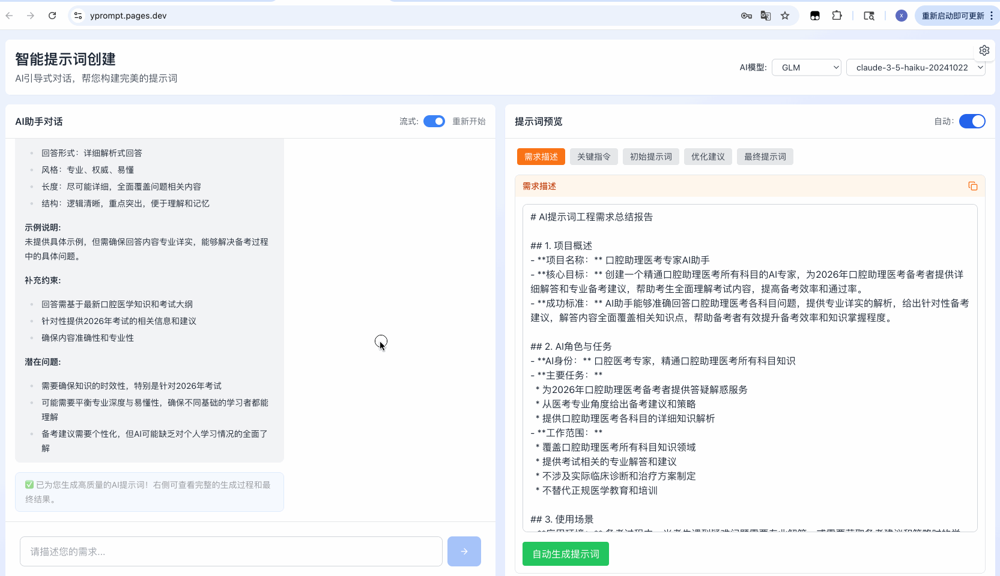

# YPrompt - 智能提示词生成工具

基于AI对话引导挖掘用户需求的专业提示词生成系统，基于《Architecting Intelligence: A Definitive Guide to the Art and Science of Elite Prompt Engineering》理论生成高质量的AI提示词。

## 一键部署

在 Github 上先[](https://github.com/fish2018/YPrompt/fork)本项目，并点上 Star !!!

[](https://vercel.com/new/clone?repository-url=https://github.com/fish2018/YPrompt&build-command=npm%20run%20build&install-command=npm%20install&output-directory=dist)

**Vercel 部署步骤**
1. Fork 本仓库到您的 GitHub 账户
2. 登录 Vercel，点击 "New Project"
3. 导入您的仓库
4. 配置构建参数：
   - Install Command: `npm install`
   - Build Command: `npm run build`
   - Output Directory: `dist`
5. 点击 "Deploy"

## 截图
**PC端**  
  


**移动端**  


## 核心功能

- **AI引导式需求收集**: 通过智能对话深入挖掘用户真实需求
- **GPrompt四步生成**: 关键指令提取 → 初始提示词 → 优化建议 → 最终提示词
- **多AI模型支持**: 支持OpenAI、Anthropic、Google Gemini和自定义AI服务商
- **双模式操作**: 自动生成和手动步进两种执行模式
- **格式语言转换**: 支持Markdown/XML格式切换和中英文互译
- **响应式设计**: 完美适配桌面端和移动端设备

## 技术栈

- **前端框架**: Vue 3 + TypeScript
- **构建工具**: Vite
- **UI框架**: Tailwind CSS
- **状态管理**: Pinia
- **图标库**: Lucide Vue Next
- **Markdown**: Marked

## 项目结构

```
src/
├── components/          # Vue组件
│   ├── ChatInterface.vue       # 对话界面
│   ├── PreviewPanel.vue        # 预览面板
│   ├── PromptGenerator.vue     # 提示词生成器
│   ├── SettingsModal.vue       # 设置弹窗
│   └── NotificationContainer.vue  # 通知容器
├── stores/              # Pinia状态管理
│   ├── promptStore.ts           # 提示词状态
│   ├── settingsStore.ts        # 设置状态
│   └── notificationStore.ts    # 通知状态
├── services/            # 业务服务层
│   ├── aiService.ts             # AI服务基础类
│   ├── aiGuideService.ts        # AI引导服务
│   └── promptGeneratorService.ts # 提示词生成服务
├── config/              # 配置文件
│   ├── promptGenerator.ts       # 生成器配置
│   └── prompts/                # 内置提示词规则
├── views/               # 页面视图
└── main.ts              # 应用入口
```